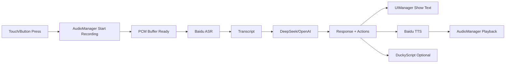

# Deepseek (Kode Dot ESP32-S3 Voice Assistant)

基于 Kode Dot (ESP32-S3) 的语音助手固件：按住触摸或按键录音，调用 ASR + LLM 生成回复，屏幕显示并可语音播报，支持 DuckyScript 动作输出。

## 1. 项目架构

### 1.1 核心模块

- `src/main.cpp`
  - 系统入口、状态机、任务调度、流程编排。
- `lib/audio_manager/`
  - I2S 录音与播放、PCM 缓冲、归一化处理。
- `lib/ui_manager/`
  - LVGL UI、状态切换、打字机动画、字体与滚动显示。
- `lib/wifi_manager_lib/`
  - SD 卡加载 Wi-Fi/APIs 配置，多网络连接重试。
- `lib/basicgpt_client/`
  - 访问 LLM（DeepSeek/OpenAI）HTTP 请求封装。
- `lib/baidu_asr/`
  - 百度 ASR 语音识别。
- `lib/baidu_tts/`
  - 百度 TTS 语音合成。
- `lib/led_manager/`
  - NeoPixel 状态灯管理。
- `lib/DuckyScript/`
  - 可选 BadUSB 键盘指令执行。

### 1.2 运行数据流



### 1.3 关键特性

- 文本显示支持 UTF-8，且支持超出区域滚动。
- 仅保留较大中文显示字体（已按当前配置优化）。
- 文字显示与 TTS 播放做了同步策略（边显示边播放）。
- 通过分段 benchmark 日志（ASR/LLM/TTS）定位时延瓶颈。

## 2. SD 卡配置文件

固件启动后会从 SD 卡根目录读取以下文件。

### 2.1 `/wifi.txt` 示例

```txt
# 最多支持 3 组网络
NAME=Home
SSID=HUAWEI-yang
PASSWORD=your_password_here
---
NAME=Office
SSID=OfficeWiFi
PASSWORD=office_password
---
NAME=Backup
SSID=PhoneHotspot
PASSWORD=hotspot_password
END
```

说明：
- `NAME` 可选但建议填写，便于日志识别。
- `SSID` 与 `PASSWORD` 必填。
- 分段可用 `---` 或 `END`。

### 2.2 `/apis.txt` 示例

```txt
# 必填至少一种 LLM Key
DEEPSEEK=sk-xxxxxxxxxxxxxxxx
# OPENAI=sk-xxxxxxxxxxxxxxxx

# 选择默认服务: openai / deepseek / deepseek_force
PREFER=deepseek_force

# Baidu ASR/TTS 凭据（二选一方式）
# 方式 A：统一授权 key
BAIDU_ASR_AUTH_KEY=xxxxxxxxxxxxxxxx

# 方式 B：API_KEY + SECRET_KEY
# BAIDU_ASR_API_KEY=xxxxxxxxxxxxxxxx
# BAIDU_ASR_SECRET_KEY=xxxxxxxxxxxxxxxx
```

说明：
- `PREFER=deepseek_force` 表示只走 DeepSeek，不回退 OpenAI。
- 若启用语音链路（ASR/TTS），需提供百度相关凭据。
- 文件中的密钥不要提交到 Git。

## 3. 环境与工具安装

## 3.1 必需工具

- Visual Studio Code
- PlatformIO IDE 扩展（推荐）
- Git（可选）
- USB 串口驱动（按你的板卡 USB-UART 芯片安装）

## 3.2 命令行可选方案

若不使用 VS Code 插件，也可安装 PlatformIO Core：

```powershell
pip install platformio
```

安装后可使用 `pio` 命令编译与烧录。

## 3.3 项目关键配置

- 环境名：`kode_dot`
- 板卡定义：`boards/kode_dot.json`
- 分区表：`partitions_app_new.csv`
- App 分区：`factory = 0x800000`（8 MB）
- 串口速率：`monitor_speed = 115200`

## 4. 编译、烧录、串口监视

在项目根目录执行。

### 4.1 编译

```powershell
pio run -e kode_dot
```

### 4.2 烧录

```powershell
pio run -e kode_dot -t upload
```

### 4.3 串口监视

```powershell
pio run -e kode_dot -t monitor
```

或使用：

```powershell
pio device monitor -b 115200
```

### 4.4 一步到位（烧录+监视）

```powershell
pio run -e kode_dot -t upload -t monitor
```

## 5. 首次运行检查清单

- SD 卡已插入，且 `/wifi.txt`、`/apis.txt` 内容正确。
- 串口日志出现：
  - `[Setup] CuteAssistant ready!`
  - `[WiFi] Connected: IP=...`
- 触摸或按键可进入录音，随后看到：
  - `[Benchmark] ASR time: ...`
  - `[Benchmark] DeepSeek time: ...`
  - `[Benchmark] Total time: ...`

## 6. 常见问题排查

- 启动后提示找不到配置：
  - 检查 SD 卡是否正常挂载，确认文件名完全匹配 `/wifi.txt`、`/apis.txt`。
- 固件过大导致无法启动：
  - 当前 `factory` 分区仅 8 MB，避免引入过大字体或资源。
- 串口偶发 `ssl_client ... UNKNOWN ERROR CODE (004C)`：
  - 这是网络层常见瞬时错误，若请求仍成功可先忽略；重点看 `Benchmark` 实际时延。
- 响应慢：
  - 先对比 ASR / DeepSeek / TTS 分段耗时，按最大项优化。

## 7. 目录速览

```txt
src/                    应用入口与主流程
lib/audio_manager/      录音/播放
lib/ui_manager/         界面与文本显示
lib/wifi_manager_lib/   Wi-Fi 与 API 配置读取
lib/basicgpt_client/    LLM 客户端
lib/baidu_asr/          语音识别
lib/baidu_tts/          语音合成
boards/                 自定义板卡定义
extra_scripts/          PlatformIO 预处理脚本
partitions_app_new.csv  分区表
platformio.ini          编译配置
```

## 8. 安全建议

- 不要把真实密钥写入仓库。
- 建议本地 `apis.txt` 使用真实密钥，仓库仅保留模板。
- 对外分享日志前，先打码 token 和 Wi-Fi 信息。
